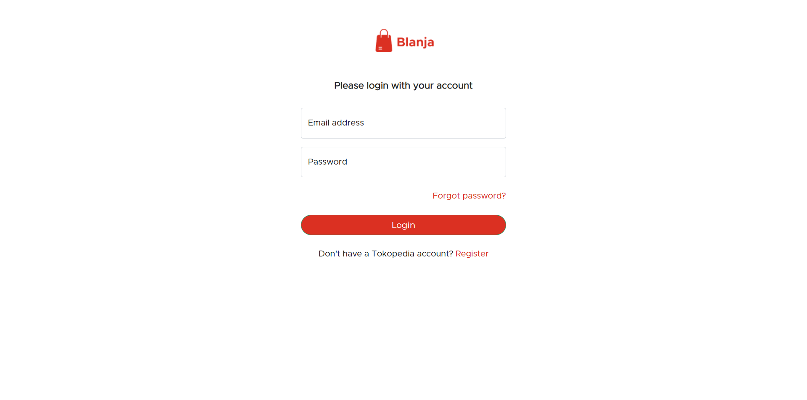
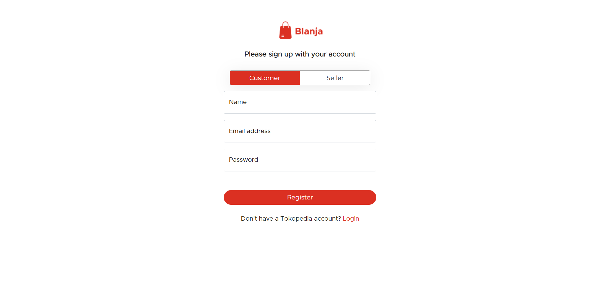
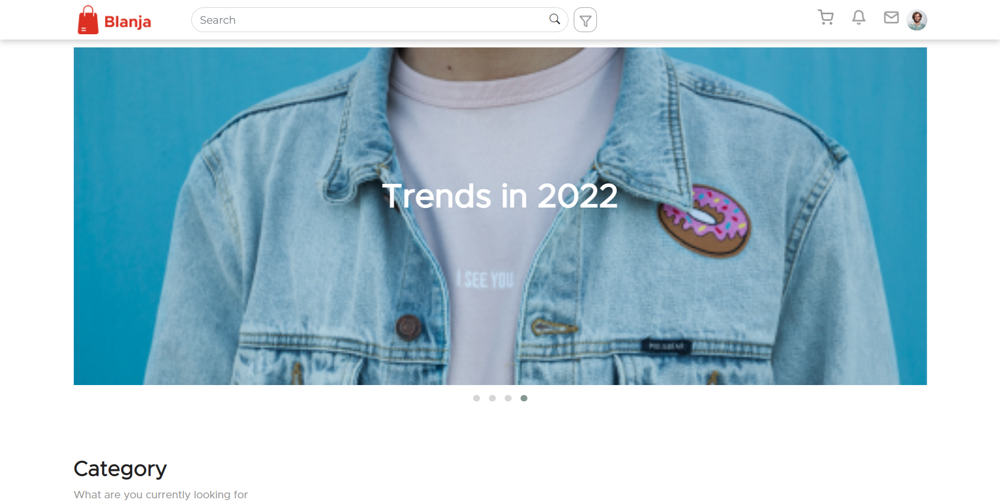
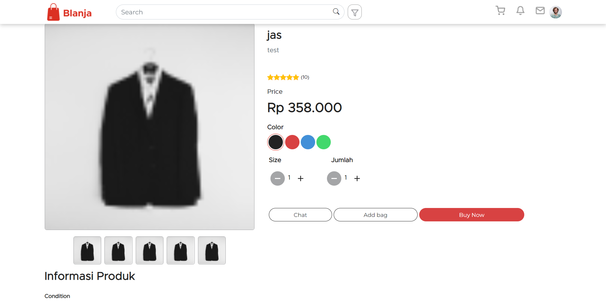

<div align="center">
  
</div>
<h3 align="center">Blanja Frontend</h3>
<p align="center">
  <a href="https://blanja-frontend.vercel.app/">View Demo</a>
</p>

<!-- ABOUT THE PROJECT -->

## About The Project

blanja is a website-based application that makes it easy for people to get products that are sold online by other people. blanja is developed with PERN satck (PostgreSQL, Express.js, React.js, Node.js). Blanja is an Individual project, here I created Backend and Frontend. blanja is a website-based application that makes it easy for people to get products that are sold online by other people. blanja is developed with PERN satck (PostgreSQL, Express js, Reactjs, Node js). blanja is an Individual project, here I create Backend and Frontend.

### Technology Used

- [ReactJS](https://reactjs.org/)
- [Redux](https://redux.js.org/)
- [Bootstrap](https://getbootstrap.com/)
- [Axios](https://github.com/axios/axios)

<!-- GETTING STARTED -->

## Getting Started

### Installation

- Clone This Repository

`git clone https://github.com/Massbim/blanja-frontend`

- Install Module

`npm install`

- Setting .env

```bash
REACT_APP_API_BACKEND=YOUR_API_URL
```

### Executing program

- Run this project with `npm run start`.

<!-- SCREENSHOT -->

## Screenshot

### Register



### Login



### Home



### Product Detail



<!-- CONTACT INFO -->

## Contact Info

Contributors names and contact info:

1. Alamsyah Bimasakti Qobus Nur Rahman

- [Linkedin](https://www.linkedin.com/in/alamsyahbimasakti)

## License

This project is licensed under the MIT License - see the LICENSE file for details
